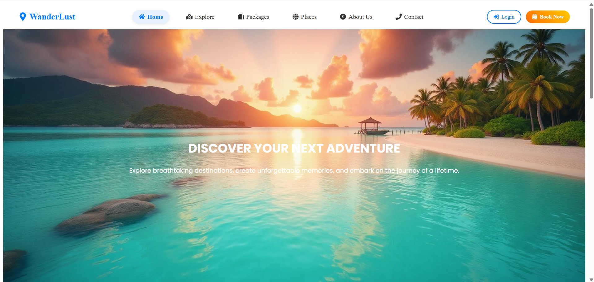
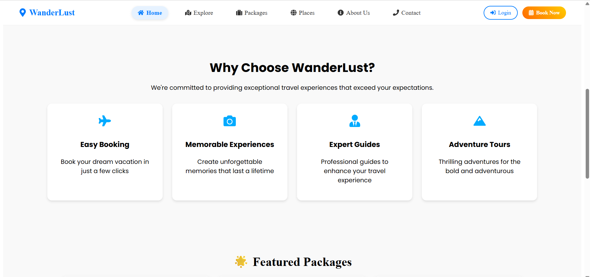
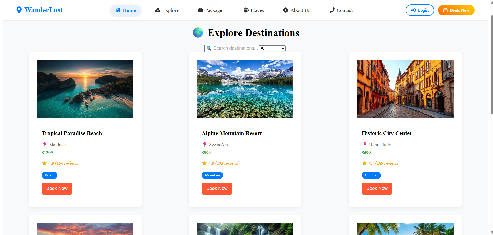
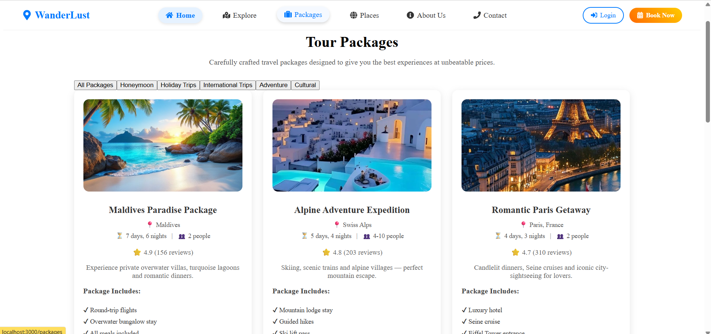
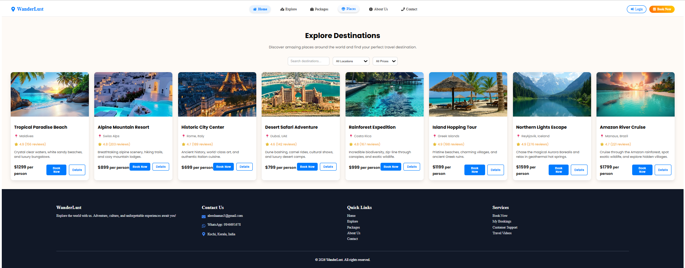
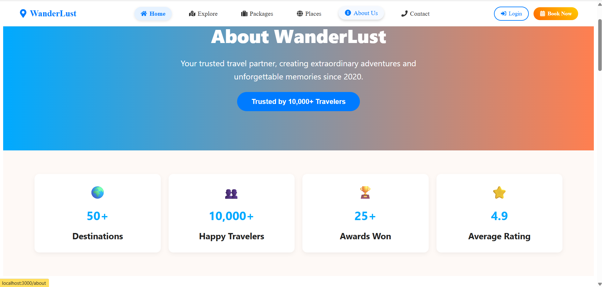
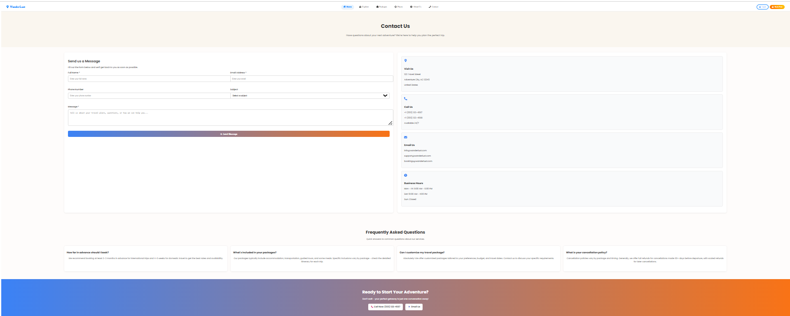
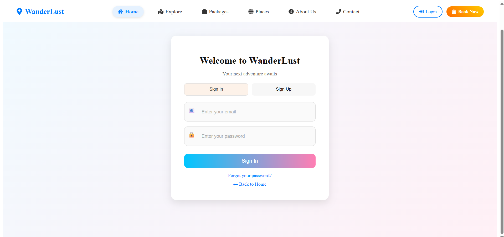

WanderLust - Tourism Management System

WanderLust is a full-stack Tourism Management System built using the MERN stack (MongoDB, Express.js, React.js, Node.js). It is a modern travel booking platform where users can explore destinations, browse travel packages, register/login, and manage bookings through a responsive and user-friendly interface.

Live Demo: https://tourism-management-nvmo.vercel.app/

Features
User Features
  Explore popular travel destinations
  View featured and categorized travel packages
  Search and filter destinations
  User registration and login
  Book tour packages
  Contact travel support
  Responsive modern UI
  
Admin Features
  Manage destinations
  Manage travel packages
  Manage users
  Handle bookings
  Store and manage travel data in MongoDB
  
Tech Stack
  Frontend
  React.js
  CSS3
  React Router DOM
  Axios
  
Backend
  Node.js
  Express.js
  MongoDB
  Mongoose
  JWT Authentication
  Deployment
  Vercel (Frontend + Backend)
  MongoDB Atlas (Database)

Project Structure

tourism-management/
│
├── backend/                  # Node.js + Express backend
│   ├── config/
│   ├── controllers/
│   ├── models/
│   ├── routes/
│   ├── index.js
│   └── package.json
│
├── frontend/                 # React frontend
│   ├── public/
│   ├── src/
│   └── package.json
│
├── screenshots/              # Project screenshots
│   ├── home-hero.png
│   ├── home-features.png
│   ├── explore-page.png
│   ├── packages-page.png
│   ├── places-page.png
│   ├── about-page.png
│   ├── contact-page.png
│   └── login-page.png
│
├── vercel.json
└── README.md

Installation & Setup
1. Clone Repository
git clone https://github.com/aleesha6127/tourism-management.git
cd tourism-management
2. Setup Backend
cd backend
npm install
npm run dev

Backend runs on:
http://localhost:5000

3. Setup Frontend

Open a new terminal:

cd frontend
npm install
npm start

Frontend runs on:
http://localhost:3000

## Screenshots

### Home Hero Section

### Home Features Section

### Explore Destinations

### Tour Packages

### Places Page

### About Us

### Contact Page

### Login Page

